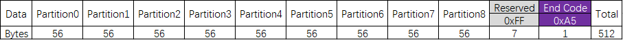
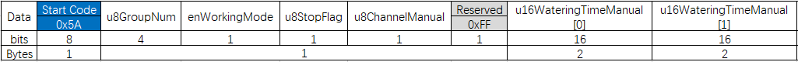
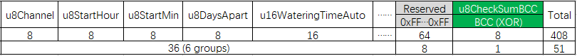

## P201-PUMP HDMCU Project

### 简介

本项目是基于华大 MCU 开发的 P201 抽水机项目。MCU 型号是 HC32L136K8TA-LQFP64。此文档主要记录软件相关的笔记。

### 开发环境

* Keil MDK 532
* Arm Compiler V6.14.1 或以下，Arm Compiler V6.15 会有问题，详见 [《Keil MDK 5.33 运行华大官方示例无法进入 Timer0 中断》](https://blog.csdn.net/heray1990/article/details/113838794)

### 入门资料和参考文章

* [华大官网 HC32L136K8TA-LQFP64 文档、驱动库与示例](https://www.hdsc.com.cn/Category82-1404)
* [《华大单片机DDL库与lite库的区别》](https://blog.csdn.net/willOkay/article/details/106535809)
* [《如何用 Keil 新建一个工程》](https://blog.csdn.net/willOkay/article/details/106533167)
* [《Keil MDK 5.33 运行华大官方示例无法进入 Timer0 中断》](https://blog.csdn.net/heray1990/article/details/113838794)
* 状态机按键消抖：[《Debouncing Push-Buttons Using a State Machine Approach》](https://www.eeweb.com/debouncing-push-buttons-using-a-state-machine-approach/)，参考代码：[https://github.com/tommygartlan/Buttons_Debounce_State_Mch](https://github.com/tommygartlan/Buttons_Debounce_State_Mch)

### Flash 数据存储结构

HC32L136K8TA-LQFP64 包含一块 64K Bytes 容量的 Flash 存储器（详见芯片用户手册）。本项目利用 0x0000E000~0x0000FFFF 这个区域来保存数据，共 6 个 Sector，每个 Sector 512 Bytes，共 8192 Bytes。

