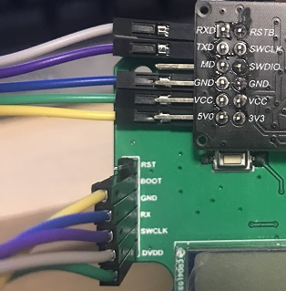
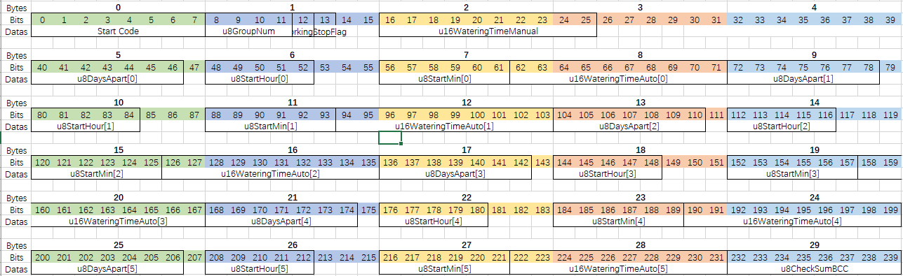

## P201-PUMP HDMCU Project

### 简介

本项目是基于华大 MCU 开发的 P201 抽水机项目。MCU 型号是 HC32L136K8TA-LQFP64。此文档主要记录软件相关的笔记。

### 开发环境

* Keil MDK 532
* Arm Compiler V6.14.1 或以下，Arm Compiler V6.15 会有问题，详见 [《Keil MDK 5.33 运行华大官方示例无法进入 Timer0 中断》](https://blog.csdn.net/heray1990/article/details/113838794)

### 入门资料和参考文章

* [华大官网 HC32L136K8TA-LQFP64 文档、驱动库与示例](https://www.hdsc.com.cn/Category82-1404)
* [《华大单片机DDL库与lite库的区别》](https://blog.csdn.net/willOkay/article/details/106535809)
* [《如何用 Keil 新建一个工程》](https://blog.csdn.net/willOkay/article/details/106533167)
* [《Keil MDK 5.33 运行华大官方示例无法进入 Timer0 中断》](https://blog.csdn.net/heray1990/article/details/113838794)
* 状态机按键消抖：[《Debouncing Push-Buttons Using a State Machine Approach》](https://www.eeweb.com/debouncing-push-buttons-using-a-state-machine-approach/)，参考代码：[https://github.com/tommygartlan/Buttons_Debounce_State_Mch](https://github.com/tommygartlan/Buttons_Debounce_State_Mch)

### 烧录模式

#### ISP 串口烧录模式

1. 到华大官网下载“**Cortex-M在线编程器.zip**”：https://www.hdsc.com.cn/Category82-1404

   

2. 解压步骤1下载到的压缩包，打开里面的文档《Cortex-M在线编程器用户手册Rev2.0.pdf》可以找到串口模块与 MCU 引脚连接图。其中 P201 的引脚连接图和实物图如下：

3. 引脚接线 OK 之后，把串口工具插入电脑，然后打开压缩包中的 **hdsc.exe** 程序，按照《Cortex-M在线编程器用户手册Rev2.0.pdf》文档中的说明进行设置即可完成烧录。其中**Hex文件**是 Keil 编译生成的文件。下面是实际烧录过程。

#### SWD 烧录模式

P201 SWD 烧录模式实物接线图如下：

### Flash 数据存储结构

HC32L136K8TA-LQFP64 包含一块 64K Bytes 容量的 Flash 存储器（详见芯片用户手册）。本项目利用 0x0000E000~0x0000FFFF 这个区域来保存数据，共 16 个 Sector，每个 Sector 512 Bytes，共 8192 Bytes。每个 Sector 能容纳 17 个分区（Partition）的数据。每个分区保存着程序中需要的数据，共 30 Bytes。

**Sector 地址对照表**

**每个 Sector 分区表**

#### 数据取值范围与最小需要的位数

* **Start Code**: 0x5A, 8bits
* **u8GroupNum**: 0~9, 4bits
* **enWorkingMode**: 0~1, 1bit
* **u8StopFlag**: 0~1, 1bit
* **u8ChannelManual**: 0~1, 1bit
* **Reserved**: 0~1, 1bit
* **u16WateringTimeManual[0]**: 0~999, 10bits
* **u16WateringTimeManual[1]**: 0~999, 10bits
* **u8DaysApart[0]**: 0~99, 7bits
* **u8ChannelAuto[0]**: 0~1, 1bit
* **u8StartHour[0]**: 0~24, 5bits
* **u8StartMin[0]**: 0~60, 6bits
* **u16WateringTimeAuto[0]**: 0~999, 10bits
* ......
* **u8DaysApart[5]**: 0~99, 7bits
* **u8ChannelAuto[5]**: 0~1, 1bit
* **u8StartHour[5]**: 0~24, 5bits
* **u8StartMin[5]**: 0~60, 6bits
* **u16WateringTimeAuto[5]**: 0~999, 10bits
* **u8CheckSumBCC**: 校验位, 8bits

**分区（Partition）数据**

